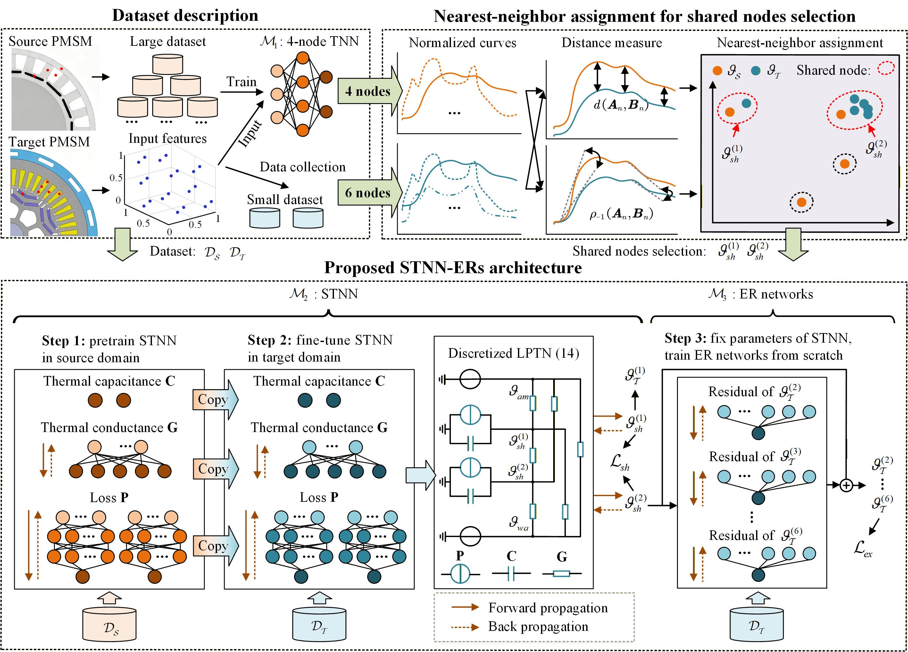
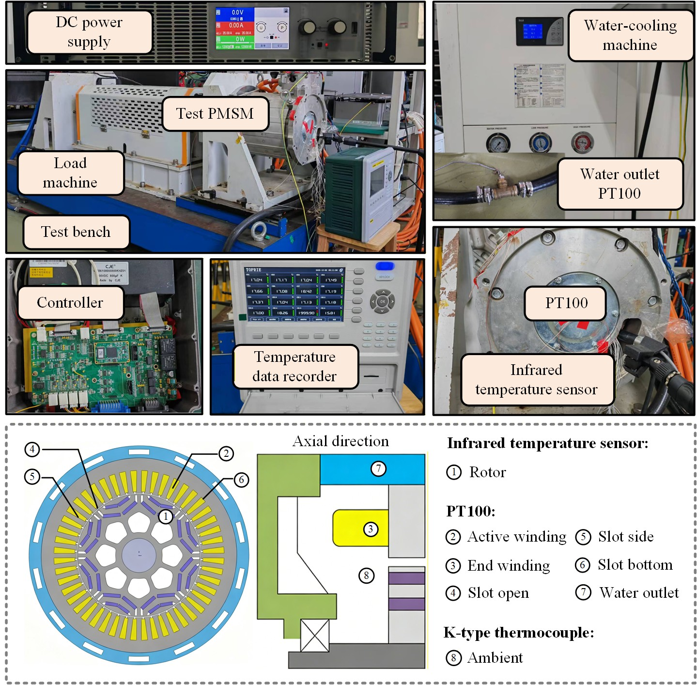
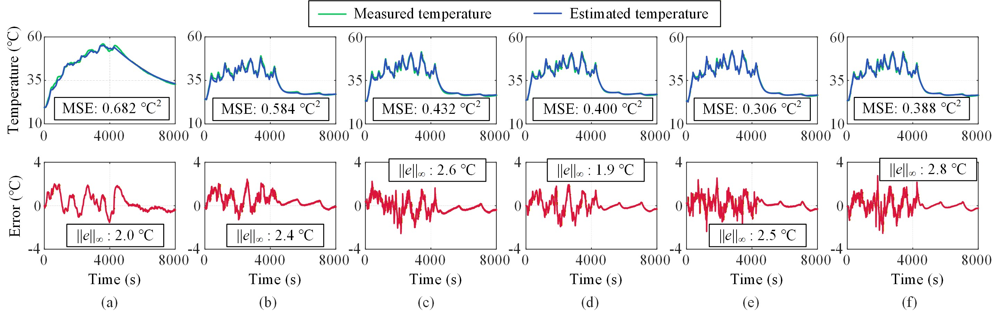

# STNN-ERs: Shared-Node Thermal Neural Network with Extended-Node Residuals for Multi-Node Temperature Estimation

This repository contains the code, datasets, pretrained model, and supplementary materials for a manuscript currently under review.

Our work proposes **STNN-ERs**, a transfer-learning framework built upon the Thermal Neural Network (TNN), for multi-node temperature estimation of electric motors. The method is designed to improve temperature prediction performance in the target domain by combining shared-node transfer and extended-node residual learning.

---

## Repository Contents

- `STNN_ERs/final_TNN_2nodes4trans0328.ipynb` : main notebook containing the implementation, training, and evaluation workflow
- `STNN_ERs/dataset/` : source-domain and target-domain data
- `STNN_ERs/model/stnn_pretrain.pt` : pretrained source-domain model checkpoint
- `figure/` : hardware platform images and experimental result figures

---

## Main Contributions

- A transfer-learning based temperature estimation framework is proposed for PMSM thermal modeling.
- An STNN-ERs architecture is developed. It contains two parts: STNN and ERs, which are used to learn the shared thermal characteristics and specific thermal differences between PMSMs, respectively.
- The results are validated on a public source-domain dataset and a self-collected target-domain dataset.

---
## Data Description

### Source Domain Data

The source-domain data used in this work is collected by the Department of Power Electronics and Electrical Drives (LEA), Paderborn University.  
The dataset is publicly available on Kaggle and can be cited as:

> Wilhelm Kirchgässner, Oliver Wallscheid, and Joachim Böcker. *Electric Motor Temperature*. Kaggle, 2021.  
> URL: https://www.kaggle.com/dsv/2161054  
> DOI: 10.34740/KAGGLE/DSV/2161054

### Target Domain Data

The target-domain data was collected on our own hardware platform and is provided in:
STNN_ERs/dataset/target_data.csv

## Model Description

The proposed **STNN-ERs** model is developed based on the **Thermal Neural Network (TNN)** framework. TNN structure and training pipeline is first implemented with reference to the following open-source project:

- [Thermal Neural Networks (TNN)](https://github.com/wkirgsn/thermal-nn)

We thank the original author for making the code and ideas publicly available.

The diagram of proposed STNN-ERs is shown below.

  

It contains two parts: a shared-node thermal neural network (STNN) and extend-node residuals (ERs). STNN is first pretrained using source-domain dataset, and the fined-tuned using target-domain dataset. ERs are trained from scratch using target-domain dataset.

### Pretrained Model

The pretrained source-domain model is stored in:
STNN_ERs/model/stnn_pretrain.pt

## Hardware Platform

The target-domain experiments are conducted on our self-built hardware platform.

  

## Experimental Results

Estimation results of multiple nodes are shown below.

  

## Our manuscript
This paper is currently under review. More details will be added after publication.

## Contact
For any queries or further discussion regarding the project, please open an issue in this repository or direct connect kaipeng@hust.edu.cn.
